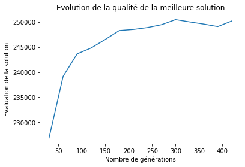

# Résolution de Problèmes : Algorithmes génétiques et recherche locale 

Projet réalisé dans le cadre de l'UE Résolution de Problèmes (RP). 

Le but du projet est de mettre en œuvre un algorithme génétique, de l'appliquer au problème du voyageur de commerce (TSP), et de l'améliorer grâce à la recherche locale.

Ce repository contient le sujet du mini-projet, le code source ainsi qu'une représentation graphique de l'évolution de la qualité de la meilleure solution en fonction du nombre de générations :

